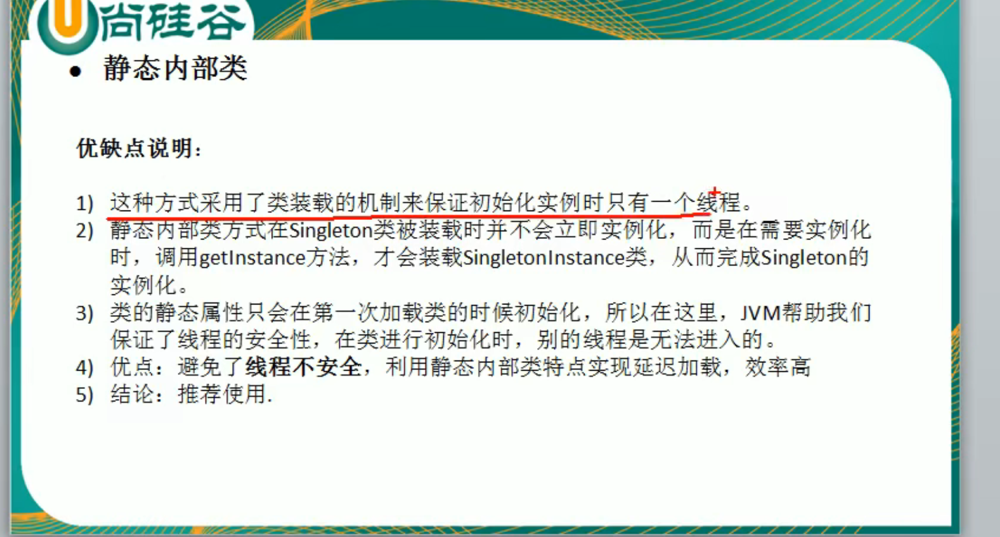

抛出一个问题？
模拟鸭子应用
鸭子一遍游泳划水，一遍呱呱叫
## 软件设计模式的产生背景
“设计模式”这个术语最初并不是出现在软件设计中，而是被用于建筑领域的设计中。

1977年，美国著名建筑大师克里斯托夫·亚历山大在他的著作《建筑模式语言：城镇、建筑、构造（A Pattern Language: Towns Building Construction）中描述了一些常见的建筑设计问题，并提出了 253 种关于对城镇、邻里、住宅、花园和房间等进行设计的基本模式。

1979年，他的另一部经典著作《建筑的永恒之道》（The Timeless Way of Building）进一步强化了设计模式的思想，为后来的建筑设计指明了方向。

1987年，肯特·贝克（Kent Beck）和沃德·坎宁安（Ward Cunningham）首先将克里斯托夫·亚历山大的模式思想应用在 Smalltalk 中的图形用户接口的生成中，但没有引起软件界的关注。

1990年，软件工程界才开始研讨设计模式的话题，后来召开了多次关于设计模式的研讨会。

1995年，艾瑞克·伽马（ErichGamma）、理査德·海尔姆（Richard Helm）、拉尔夫·约翰森（Ralph Johnson）、约翰·威利斯迪斯（John Vlissides）等 4 位作者合作出版了《设计模式：可复用面向对象软件的基础》（Design Patterns: Elements of Reusable Object-Oriented Software）一书，在本教程中收录了 23 个设计模式，这是设计模式领域里程碑的事件，导致了软件设计模式的突破。这 4 位作者在软件开发领域里也以他们的“四人组”（Gang of Four，GoF）匿名著称。

直到今天，狭义的设计模式是 GoF 23 种经典设计模式。

## 软件设计模式的目的
为了提高代码的可重用性、代码的可阅读性和代码的可靠性

## GoF 23中 设计模式的划分

#### 根据作用范围来分
* 类模式：用于处理类与子类之间的关系，这些关系通过继承来建立，是静态的，在编译时刻便确定下来了。
* 对象模式 ：用于处理对象之间的关系，这些关系可以通过组合或聚合来实现，在运行时刻是可以变化的，更具动态性。

举个例子：例如适配器模式

适配器模式（Adapter）包含以下主要角色。
1. 目标（Target）接口：当前系统业务所期待的接口，它可以是抽象类或接口。
2. 适配者（Adaptee）类：它是被访问和适配的现存组件库中的组件接口。
3. 适配器（Adapter）类：它是一个转换器 
   - 类模式实现：适配器类 通过继承适配者，把适配者接口转换成目标接口，让客户按目标接口的格式访问适配者
   - 对象模式实现：适配器类 通过引用适配者的对象，把适配者接口转换成目标接口，让客户按目标接口的格式访问适配者

#### 根据目的分类
* 创建型模式：用于描述“怎样创建对象”，它的主要特点是“将对象的创建与使用分离”
* 结构型模式：用于描述如何将类或对象按某种布局组成更大的结构
* 行为型模式：用于描述类或对象之间怎样相互协作共同完成单个对象都无法单独完成的任务，以及怎样分配职责

##### 创建型模式
* 单例模式  
  - 饿汉式
    1. 静态变量
    2. 静态代码块
  - 懒汉式
    1. 同步代码块
    2. 双重检查 （推荐）  
    3. 静态内部类（推荐）
    4. 枚举类（强烈推荐 effective java）
* 工厂模式
* 原型模式
* 建造者模式

## reference：
* C语言编程网-JAVA设计模式 http://c.biancheng.net/view/1317.html
* 菜鸟教程-设计模式 https://www.runoob.com/design-pattern/design-pattern-tutorial.html
* 双重检查锁定与延迟初始化 https://www.infoq.cn/article/double-checked-locking-with-delay-initialization/

